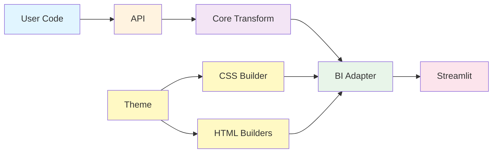
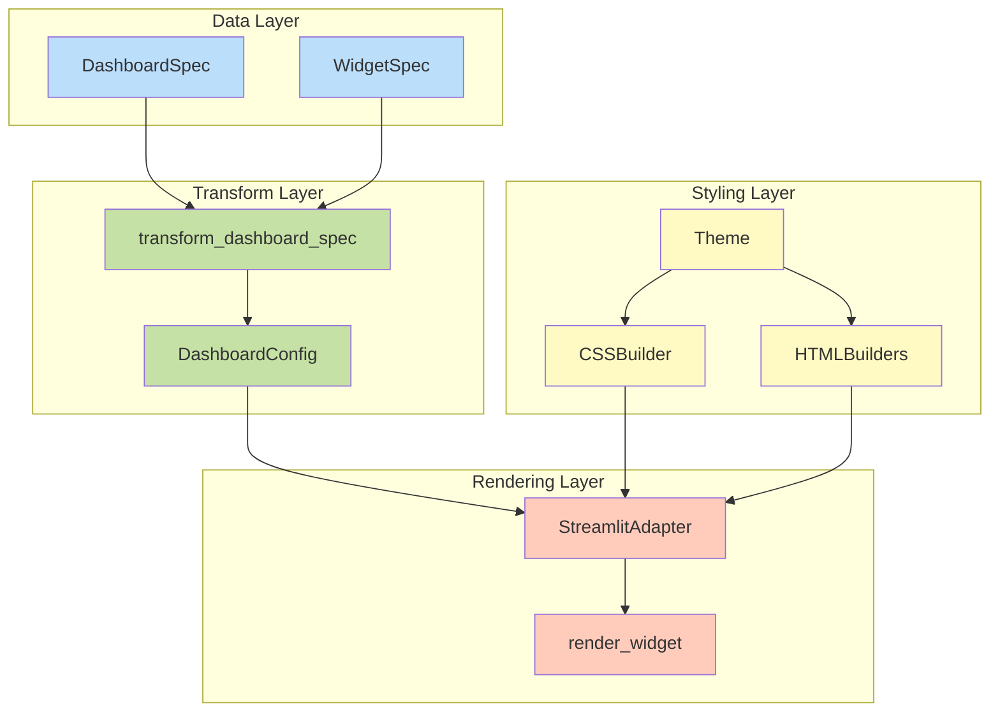
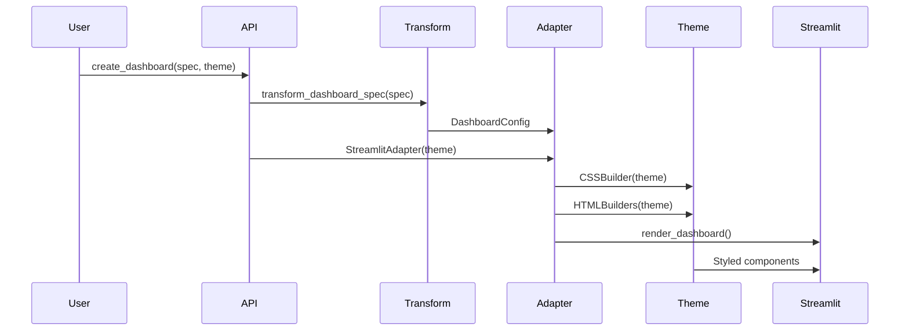

# Dynamic Dashboard Library

A flexible, theme-aware Python library for creating professional business dashboards with minimal code.

## 🎯 Project Goal

Build a **declarative dashboard library** that:
- ✅ Separates data from presentation
- ✅ Supports multiple BI adapters (Streamlit, PowerBI, Tableau)
- ✅ Provides professional themes out-of-the-box
- ✅ Enables rapid dashboard development
- ✅ Maintains clean separation of concerns

## 🏗️ Project Structure

```
dynamic_dashboard/
├── core/                    # Business logic
│   ├── specs.py            # Dashboard specifications (data models)
│   └── transform.py        # Spec → Config transformation
├── bi_adapters/            # Rendering layer
│   ├── base.py             # Adapter interface
│   └── streamlit_adapter.py # Streamlit implementation
├── themes/                 # Styling layer
│   ├── base.py             # Theme data (colors, fonts, spacing)
│   ├── css_builder.py      # Theme → CSS conversion
│   └── html_builders.py    # Themed HTML components
├── examples/               # Example dashboards
│   ├── simple_scorecard.py
│   ├── comprehensive_demo.py
│   ├── dark_comprehensive_demo.py
│   └── ocean_theme_demo.py
└── api.py                  # Public API
```

## 🎨 Architecture

### High-Level Architecture



### Separation of Concerns



## 🚀 Quick Start

### Installation

```bash
# Clone the repository
git clone <repository-url>
cd dynamic_dashboard

# Install dependencies
uv sync
```

### Basic Usage

```python
from api import create_dashboard
from core.specs import DashboardSpec, WidgetSpec, WidgetType
import pandas as pd

# Create sample data
sales_data = pd.DataFrame({
    'date': pd.date_range('2024-01-01', periods=30),
    'sales': [15000, 18000, 22000, ...]
})

# Define dashboard
dashboard = DashboardSpec(
    dashboard_id="sales_dashboard",
    title="Sales Dashboard",
    widgets=[
        # Scorecard
        WidgetSpec(
            widget_id="total_sales",
            widget_type=WidgetType.SCORECARD,
            title="Total Sales",
            data={"value": 750000}
        ),
        # Time series chart
        WidgetSpec(
            widget_id="sales_trend",
            widget_type=WidgetType.TIME_SERIES,
            title="Sales Trend",
            data=sales_data
        )
    ]
)

# Render dashboard
create_dashboard(dashboard)
```

### Run Examples

```bash
# Professional theme (light)
uv run streamlit run examples/comprehensive_demo.py

# Dark theme
uv run streamlit run examples/dark_comprehensive_demo.py

# Ocean theme
uv run streamlit run examples/ocean_theme_demo.py
```

## 🎨 Themes

The library includes three built-in themes:

### Professional Theme (Default)
Clean, light theme for business dashboards
```python
create_dashboard(dashboard, theme="professional")
```

### Dark Theme
Modern dark mode for reduced eye strain
```python
create_dashboard(dashboard, theme="dark")
```

### Ocean Theme
Blue/teal color scheme
```python
create_dashboard(dashboard, theme="ocean")
```

### Custom Themes

Create your own theme:

```python
from themes import Theme, ThemeColors, ThemeTypography, ThemeSpacing, register_theme

custom_theme = Theme(
    name="custom",
    colors=ThemeColors(
        background="#ffffff",
        card_background="#f5f5f5",
        border="#e0e0e0",
        text_primary="#212121",
        text_secondary="#757575",
        text_muted="#9e9e9e",
        chart_primary="#1976d2",
        chart_grid="#f5f5f5",
        chart_axis="#e0e0e0",
        positive="#4caf50",
        negative="#f44336"
    ),
    typography=ThemeTypography(
        font_family="Arial, sans-serif",
        title_size="16px",
        subtitle_size="14px",
        body_size="13px",
        caption_size="12px",
        metric_size="32px",
        title_weight="600",
        subtitle_weight="600",
        body_weight="400"
    ),
    spacing=ThemeSpacing(
        card_padding="20px",
        card_margin="16px",
        card_border_radius="8px",
        card_shadow="0 1px 3px rgba(0,0,0,0.1)"
    )
)

register_theme(custom_theme)
create_dashboard(dashboard, theme="custom")
```

## 📊 Widget Types

### Scorecard
Display a single metric with professional styling
```python
WidgetSpec(
    widget_id="metric",
    widget_type=WidgetType.SCORECARD,
    title="Total Revenue",
    data={"value": 1250000}
)
```

### Time Series Chart
Line chart for time-based data
```python
WidgetSpec(
    widget_id="trend",
    widget_type=WidgetType.TIME_SERIES,
    title="Sales Trend",
    data=df  # DataFrame with date column
)
```

### Bar Chart
Compare values across categories
```python
WidgetSpec(
    widget_id="categories",
    widget_type=WidgetType.BAR_CHART,
    title="Sales by Category",
    data=category_df
)
```

### Table
Display tabular data
```python
WidgetSpec(
    widget_id="products",
    widget_type=WidgetType.TABLE,
    title="Top Products",
    data=products_df
)
```

## 🔧 Advanced Features

### Grid Layout

```python
dashboard = DashboardSpec(
    dashboard_id="grid_dashboard",
    title="Grid Dashboard",
    layout={
        "type": "grid",
        "columns": 3,  # 3-column grid
        "gap": "medium"
    },
    widgets=[...]
)
```

### Data Flow



## 🧪 Testing

```bash
# Run a simple test
uv run streamlit run examples/simple_scorecard.py

# Test all themes
uv run streamlit run examples/comprehensive_demo.py
uv run streamlit run examples/dark_comprehensive_demo.py
uv run streamlit run examples/ocean_theme_demo.py
```

## 📚 Key Concepts

### Separation of Concerns

The library maintains clean separation between:

1. **Data Layer** (`core/specs.py`) - What to display
2. **Transform Layer** (`core/transform.py`) - Data normalization
3. **Styling Layer** (`themes/`) - How it looks
4. **Rendering Layer** (`bi_adapters/`) - Where it renders

### Theme System

Themes are completely decoupled from core logic:
- Theme = Data (colors, fonts, spacing)
- CSSBuilder = Theme → CSS conversion
- HTMLBuilders = Theme → HTML components
- Adapter = Uses builders for rendering

### Extensibility

Easy to extend:
- ✅ Add new themes (just data, no code changes)
- ✅ Add new widget types (extend adapter)
- ✅ Add new adapters (implement BaseAdapter)
- ✅ Customize styling (use builders)

## 🤝 Contributing

Contributions welcome! The modular architecture makes it easy to:
- Add new themes
- Create new widget types
- Build new adapters (PowerBI, Tableau, etc.)
- Enhance existing functionality

## 📄 License

[Your License Here]

## 🙏 Acknowledgments

Built with:
- [Streamlit](https://streamlit.io/) - Dashboard framework
- [Plotly](https://plotly.com/) - Interactive charts
- [Pandas](https://pandas.pydata.org/) - Data manipulation
