# Dynamic Dashboard - Multi-Agent Equipment Inventory System

A production-ready, multi-agent AI system for equipment inventory management with natural language chat interface and dynamic dashboard generation.


## 🎯 Overview

This application demonstrates a **multi-agent architecture** using LangGraph and OpenAI to create an intelligent equipment inventory management system. Users can ask questions in natural language and receive dynamic visualizations as responses.

**Example Queries:**
- "What's our total equipment value?" → Scorecard widget
- "Show equipment out of service" → Table widget
- "Equipment by department" → Bar chart widget
- "What's our depreciation this quarter?" → Financial scorecard

---

## 🏗️ Multi-Agent Architecture

The system uses **4 specialized agents** coordinated by LangGraph:

```mermaid
graph TB
    User[👤 User Query] --> Streamlit[Streamlit Chat Interface]
    Streamlit --> Orch[🎯 Orchestrator<br/>LangGraph StateGraph]
    
    Orch --> NLU[🧠 NLU Agent<br/>Intent Classification]
    NLU --> Orch
    
    Orch --> DB[💾 Database Agent<br/>SQL Generation]
    DB --> SQLite[(SQLite<br/>1998 Equipment)]
    SQLite --> DB
    DB --> Orch
    
    Orch --> Resp[📊 Response Generator<br/>Widget Creation]
    Resp --> Orch
    
    Orch --> Streamlit
    Streamlit --> Dashboard[📈 Dynamic Dashboard]
    
    style Orch fill:#4a90e2,color:#fff
    style NLU fill:#7b68ee,color:#fff
    style DB fill:#50c878,color:#fff
    style Resp fill:#ffa500,color:#fff
```



---

## 🤖 Agent Descriptions

### 1. **Orchestrator Agent** (LangGraph)
- **File:** `agents/orchestrator.py`
- **Purpose:** Coordinates the multi-agent workflow
- **Technology:** LangGraph StateGraph
- **Responsibilities:**
  - Routes user queries through the agent pipeline
  - Manages state between agents
  - Handles error recovery
  - Returns final results to UI

**Flow:**
```
User Input → NLU → Database → Response Generator → Dashboard
```

---

### 2. **NLU Agent** (Natural Language Understanding)
- **File:** `agents/nlu_agent.py`
- **Purpose:** Classifies user intent and extracts entities
- **Technology:** OpenAI GPT-4o-mini with Structured Outputs
- **Responsibilities:**
  - Classify intent (10 types: aggregate, filtered, status, group_by, financial, maintenance, insert, update, delete, unknown)
  - Extract entities (department, category, status, condition, equipment_name)
  - Extract filter criteria (price_min, price_max)
  - Provide confidence scores

**Example:**
```python
Input: "Show me equipment out of service"
Output: {
    "intent": "status_query",
    "entities": {"status": "Out of Service"},
    "confidence": 0.95
}
```

---

### 3. **Database Agent** (SQL Operations)
- **File:** `agents/database_agent.py`
- **Purpose:** Generates and executes SQL queries
- **Technology:** SQLite with parameterized queries
- **Responsibilities:**
  - Generate safe SQL queries from intent data
  - Execute queries with proper error handling
  - Return structured results
  - Prevent SQL injection attacks

**Supported Query Types:**
- **Aggregate:** SUM, COUNT, AVG
- **Filtered:** WHERE clauses with multiple criteria
- **Status:** Filter by equipment status
- **Group By:** Analytics by department, category, etc.
- **Maintenance:** Equipment due for service
- **Financial:** Depreciation calculations

**Example:**
```python
Input: {"intent": "status_query", "entities": {"status": "Out of Service"}}
SQL: SELECT * FROM equipment WHERE status = ?
Params: ("Out of Service",)
```

---

### 4. **Response Generator Agent** (Widget Creation)
- **File:** `agents/response_generator.py`
- **Purpose:** Converts database results into dashboard widgets
- **Technology:** Pandas + Custom Widget Specs
- **Responsibilities:**
  - Create appropriate widget types (Scorecard, Table, Bar Chart)
  - Format data for visualization
  - Generate natural language responses
  - Handle empty results gracefully

**Widget Mapping:**
| Query Type | Widget Type | Example |
|------------|-------------|---------|
| Aggregate | Scorecard | Total value: $37.7M |
| Filtered | Table | List of 42 equipment items |
| Group By | Bar Chart | Equipment by department |
| Financial | Scorecard | Depreciation: $5.2M |

---

## 📊 Database Schema

### Equipment Table
```sql
CREATE TABLE equipment (
    -- Identity
    id INTEGER PRIMARY KEY,
    asset_tag TEXT UNIQUE NOT NULL,
    name TEXT NOT NULL,
    category TEXT NOT NULL,
    manufacturer TEXT,
    model_number TEXT,
    serial_number TEXT,
    
    -- Financial
    purchase_date DATE,
    purchase_price REAL,
    current_value REAL,
    depreciation_rate REAL,
    
    -- Location & Assignment
    department TEXT NOT NULL,
    location TEXT,
    assigned_to TEXT,
    
    -- Status & Maintenance
    status TEXT DEFAULT 'Active',
    condition TEXT,
    last_maintenance_date DATE,
    next_maintenance_date DATE,
    maintenance_interval_days INTEGER,
    warranty_expiry_date DATE,
    
    -- Metadata
    notes TEXT,
    created_at TIMESTAMP,
    updated_at TIMESTAMP
);
```

**Sample Data:** 1,998 equipment items across 6 categories, 10 departments, total value $37.7M

**Categories:**
- IT Equipment (laptops, servers, networking)
- Manufacturing Equipment (CNC machines, lathes, presses)
- Office Equipment (desks, chairs, projectors)
- Medical Devices (monitors, ultrasound, defibrillators)
- Vehicles (vans, trucks, cars)
- Tools (drills, saws, wrenches)

---

## 🚀 Quick Start

### Prerequisites
- Python 3.11+
- OpenAI API key
- uv (Python package manager)

### Installation

```bash
# Clone repository
git clone https://github.com/rhuanca/dynamic_dashboard.git
cd dynamic_dashboard

# Install dependencies
uv sync

# Configure OpenAI API key
cp .env.example .env
# Edit .env and add: OPENAI_API_KEY=your_key_here

# Initialize database with sample data
uv run python database/sample_data.py

# Run application
uv run streamlit run app.py
```

The app will open at `http://localhost:8501`

---

## 💬 Example Queries

### Financial Queries
```
"What's our total equipment value?"
"What's our total depreciation?"
"Show me equipment over $50,000"
```

### Operational Queries
```
"Show me equipment out of service"
"Equipment due for maintenance this month"
"Show active equipment"
```

### Analytics Queries
```
"Show equipment by department"
"Equipment count by category"
"Group by status"
```

### Filtered Queries
```
"Show IT equipment"
"Show all laptops"
"Equipment in Building A"
```

---

## 📁 Project Structure

```
dynamic_dashboard/
├── agents/                      # Multi-agent system
│   ├── orchestrator.py         # LangGraph workflow coordinator
│   ├── nlu_agent.py            # Intent classification (OpenAI)
│   ├── database_agent.py       # SQL query generation
│   ├── response_generator.py   # Widget creation
│   └── query_utils.py          # SQL utilities
│
├── database/                    # Data layer
│   ├── schema.sql              # Database schema
│   ├── db_manager.py           # Connection management
│   ├── sample_data.py          # Sample data generator
│   ├── init.py                 # Database initialization
│   └── equipment.db            # SQLite database (gitignored)
│
├── core/                        # Dashboard core
│   ├── specs.py                # Widget specifications
│   └── transform.py            # Data transformations
│
├── bi_adapters/                 # Rendering adapters
│   ├── base.py                 # Base adapter interface
│   └── streamlit_adapter.py    # Streamlit renderer
│
├── themes/                      # UI themes
│   ├── base.py                 # Theme definitions
│   ├── css_builder.py          # CSS generation
│   └── html_builders.py        # HTML components
│
├── config/                      # Configuration
│   └── agent_config.yaml       # Agent settings
│
├── app.py                       # Main application
├── chat_handler.py             # Chat message processing
├── ui_layout.py                # UI layout components
├── ui_custom_styles.py         # Custom CSS styles
├── ui_styles.py                # Theme-based styles
├── dashboard_renderer.py       # Dashboard rendering
│
├── .env.example                # Environment template
├── pyproject.toml              # Dependencies
└── README.md                   # This file
```

---

## 🔧 Technology Stack

| Component | Technology | Purpose |
|-----------|-----------|---------|
| **Agent Framework** | LangGraph | Multi-agent orchestration |
| **LLM** | OpenAI GPT-4o-mini | Intent classification |
| **Database** | SQLite | Equipment data storage |
| **UI Framework** | Streamlit | Web interface |
| **Visualization** | Plotly | Interactive charts |
| **Data Processing** | Pandas | Data manipulation |
| **Package Manager** | uv | Dependency management |

---

## 🎨 Key Features

### ✅ Natural Language Interface
Ask questions in plain English - no SQL knowledge required

### ✅ Dynamic Widget Generation
Automatically creates appropriate visualizations based on query type

### ✅ Multi-Agent Architecture
Specialized agents for different tasks (NLU, Database, Response)

### ✅ Safe SQL Generation
Parameterized queries prevent SQL injection

### ✅ Extensible Design
Easy to add new query types, agents, or data sources

### ✅ Business-Ready Data
Realistic equipment inventory with financial tracking

### ✅ Modular Codebase
Clean separation of concerns, easy to maintain

---

## 🔐 Security

- **SQL Injection Prevention:** All queries use parameterized statements
- **API Key Management:** Environment variables for sensitive data
- **Input Validation:** NLU agent validates and sanitizes user input
- **Error Handling:** Graceful degradation on failures

---

## 🧪 Testing

```bash
# Run sample queries
uv run streamlit run app.py

# Test database operations
uv run python -c "from database.db_manager import db_manager; print(db_manager.get_equipment_count())"

# Test NLU agent
uv run python -c "from agents.nlu_agent import nlu_agent; print(nlu_agent.process_query('show total value'))"
```

---

## 📈 Performance

- **Query Response Time:** < 2 seconds for most queries
- **Database Size:** 1,998 records, ~800KB
- **LLM Latency:** ~500ms for intent classification
- **Concurrent Users:** Supports multiple simultaneous sessions

---

## 🛣️ Roadmap

- [ ] Add user authentication
- [ ] Implement "Publish Dashboard" feature
- [ ] Add more visualization types (pie charts, gauges)
- [ ] Support for multiple databases
- [ ] Export functionality (PDF, Excel)
- [ ] Real-time data updates
- [ ] Mobile-responsive design
- [ ] Multi-language support

---

## 🤝 Contributing

Contributions welcome! The modular architecture makes it easy to:
- Add new agent types
- Create new widget types
- Build new BI adapters (PowerBI, Tableau)
- Enhance NLU capabilities

---

## 📄 License

MIT License - see LICENSE file for details

---

## 🙏 Acknowledgments

Built with:
- [Streamlit](https://streamlit.io/) - Dashboard framework
- [LangGraph](https://github.com/langchain-ai/langgraph) - Agent orchestration
- [OpenAI](https://openai.com/) - Language models
- [Plotly](https://plotly.com/) - Interactive charts
- [Pandas](https://pandas.pydata.org/) - Data manipulation

---

## 📞 Contact

For questions or support, please open an issue on GitHub.

---

**Built with ❤️ using Multi-Agent AI Architecture**
